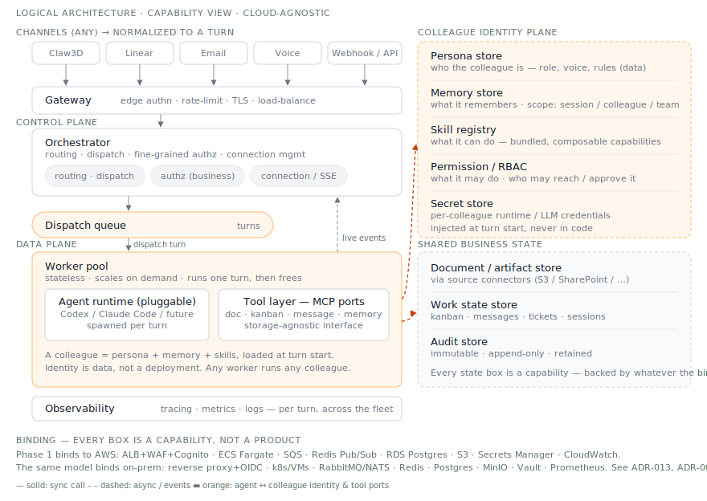

# Logical architecture — the capability model

This is the **cloud-agnostic** view of the platform: components named by *what they do*
(capabilities), not by *which product implements them*. It is the canonical model. Each phase and
each environment is a **binding** of this model onto concrete technology — Phase 1 binds it to
AWS; an on-prem deployment binds the same model to different products. Read this before any
phase diagram, because the phase diagrams are concretizations of *this*.

Why this exists as a separate view (see [ADR-013](../decisions/ADR-013-capability-oriented-logical-architecture.md)):

- **No vendor lock** ([Non-negotiable #5](./README.md)) only means something if the architecture
  itself isn't written in AWS nouns. The capability model is the contract; AWS is one supplier.
- **On-prem / VDI-bound teams** ([ADR-008](../decisions/ADR-008-vdi-presentation-only-channel.md))
  need the same system on different infrastructure. That's only possible if "the system" is
  defined by capability, not by managed service.
- **Persona, memory, and skill are first-class** here — a *Colleague Identity Plane* — not an
  afterthought hidden inside "some Postgres rows."

## The capability components

**Edge**
- **Channel adapters** — normalize any channel (Claw3D, Linear, email, voice, webhook) into one
  canonical *Turn* event. The colleague never knows which channel it came from.
- **Gateway** — edge authentication, rate-limiting, TLS, load-balancing. Coarse "can this request
  pass" — *not* business authorization.

**Control plane**
- **Orchestrator** — routing, dispatch, fine-grained (business) authorization, and holding the
  client connection open. Does no LLM work and stores no authoritative state itself.
- **Dispatch queue** — one-way hand-off of turns from orchestrator to workers.
- **Event / stream bus** — carries live turn events back from a worker to the orchestrator task
  holding the client's connection (the streaming return path).

**Execution · data plane**
- **Worker pool** — stateless executors; each runs one turn then frees itself. Any worker runs
  any colleague.
- **Agent runtime** — the per-turn LLM agent process (Codex / Claude Code / future). Pluggable;
  this is the replaceable part, not the platform.
- **Tool layer (MCP ports)** — `doc` / `kanban` / `message` / `memory` tools as a
  storage-agnostic interface. The interface is stable across phases; only the backing changes.
  **This is the platform's main extension seam:** adding a tool adds a capability a colleague can
  use (e.g. `calendar`, `search`, `email`) without touching the orchestrator or worker; swapping a
  tool's adapter changes where it's backed (e.g. `doc` → S3 *or* SharePoint, per
  [ADR-009](../decisions/ADR-009-source-connectors-distinct-from-channels.md)). It runs inside each
  worker per turn, so it scales with the worker pool — there is no separate service to scale.

**Colleague identity plane** *(this is the part that makes a colleague a colleague)*
- **Persona store** — who the colleague is: role, voice, behavior rules. Data, not code.
- **Memory store** — what it remembers across turns. Scoped: session / colleague / (later) team.
- **Skill registry** — what it can do: bundled, composable capabilities.
- **Permission / RBAC** — what it may do, and who may reach or approve it.
- **Secret store** — per-colleague runtime/LLM credentials, injected at turn start, never in code.

> **Where does this state physically live?** Deliberately *not* shown on this diagram — each box
> above is a *storage capability*, and where it physically lives is the **binding** (the table
> below), not the logical model. That's why the Phase 1 diagram looks more concrete: it *is* the
> binding. In Phase 1 (AWS): persona files → **S3**; structured memory + skill registry + RBAC →
> **Postgres**; large memory/skill artifacts → **S3**; credentials → **Secrets Manager**. Swap the
> binding column and the same capabilities live on Postgres / MinIO / Vault on-prem.

**Shared business state**
- **Document / artifact store** — the actual business content, reached through source connectors
  ([ADR-009](../decisions/ADR-009-source-connectors-distinct-from-channels.md)).
- **Work state store** — kanban, messages, tickets, sessions.
- **Audit store** — immutable, append-only, retained ([ADR-006](../decisions/ADR-006-audit-log-retention.md)).

**Cross-cutting**
- **Observability** — tracing, metrics, logs per turn and across the fleet.

## Bindings

Each capability maps to a concrete product per environment. Phase 1 is the AWS binding; the
on-prem column shows the same model is implementable without AWS.

| Capability | Phase 1 (AWS) | On-prem option |
|---|---|---|
| Gateway | ALB + WAF + Cognito | reverse proxy (nginx/Envoy) + OIDC (Keycloak) |
| Orchestrator / Worker pool | ECS Fargate | Kubernetes or VMs |
| Dispatch queue | SQS | RabbitMQ / NATS |
| Event / stream bus | ElastiCache Redis Pub/Sub | Redis / NATS |
| Persona store (AGENTS.md / Soul.md) | S3 (versioned files) | MinIO |
| Memory store | Postgres (structured) + S3 (artifacts) | Postgres + MinIO |
| Skill registry | Postgres (registry) + S3 (bundles) | Postgres + MinIO |
| Permission / RBAC | RDS Postgres | Postgres |
| Secret store | Secrets Manager + KMS | Vault |
| Document / work state | S3 + RDS Postgres (+ connectors) | MinIO + Postgres |
| Audit store | S3 Object Lock + CloudTrail | WORM storage + append-only Postgres |
| Observability | CloudWatch + OpenTelemetry | Prometheus + Grafana + OpenTelemetry |
| Agent runtime | Codex / Claude Code | Codex / Claude Code (same) |

The only place the binding is non-trivial is the **queue** and **event bus** — SQS and Redis have
no drop-in on-prem identity, so the orchestrator talks to them through a thin port (an interface),
and "SQS vs RabbitMQ" becomes a binding detail, not an architecture change. Everything else is a
near-direct substitution.
