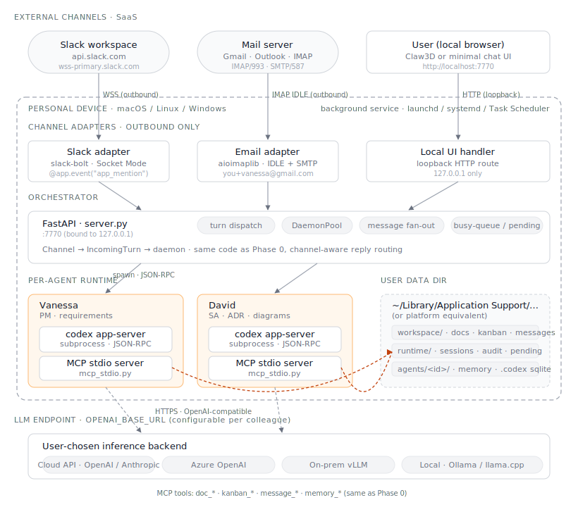

# Phase 0.5 — Edge / Personal Device

**Status:** 🚧 Exploration. Parallel track — not on the cloud progression (0 → 1 → 2 → 3).

**Scope:** Run the full digital-colleague runtime on a single personal device. Slack
and Email as the primary channels. No cloud control plane, no public ingress, no
per-user infrastructure to operate.

## Why this exists (separate from Phase 0 → 1)

Phase 0 → 1 → 2 → 3 is the **centralized SaaS** progression — one team operates it,
many users consume it. Phase 0.5 is the **decentralized personal** progression —
each user runs their own copy on their own device. It targets:

- People who can't install Codex / Claude Code (corporate policy, no admin rights)
- Air-gapped or restricted-network environments where SaaS LLM tooling is blocked
- Privacy-sensitive use cases — code, contracts, personal notes never leave the device
- Single-person or very small team scenarios where centralized infra is overkill

Phase 0.5 is **not a prerequisite** for Phase 1+. It's a sibling branch.

## Goal

A non-engineer installs one package, signs into Slack and their email mailbox once,
and from that moment can `@mention` a colleague in Slack or send an email tagged
with a colleague's name — and the agent runs on their own machine, with their own
files, using whatever LLM endpoint they choose (cloud API, on-prem, or a local
model via Ollama / llama.cpp).

## Non-goals

- Multi-user / team sharing (each device is one user's colleagues)
- High availability or "always on when device sleeps" (see trade-offs)
- Match cloud-scale latency or model quality when running purely local LLMs
- A central admin plane — there is no central plane

## Architecture (changes vs Phase 0)

Same backbone as Phase 0 — single FastAPI process, DaemonPool of `codex
app-server` subprocesses, file-based shared state under `~/Library/Application
Support/...` (or platform equivalent). What changes is **how requests get in**.

- **Channel adapters as outbound-only clients.** The device opens connections
  *to* the channels; no one opens connections *to* the device. This is what makes
  it work behind NAT / corporate firewalls without a tunnel.
  - **Slack adapter** — uses Socket Mode. The device holds an outbound WebSocket
    to `wss://wss-primary.slack.com`. Events (`app_mention`, DM) arrive via that
    socket; replies go out over the same Bot Token via Web API.
  - **Email adapter** — IMAP IDLE for inbound (long-poll, near-real-time on
    Gmail / Exchange / Outlook / generic IMAP), SMTP for outbound. Plus-addressing
    (`you+legal@gmail.com`) or a dedicated mailbox routes the request to a specific
    colleague.
  - **Local web UI** — optional Claw3D or a minimal `localhost:7770` chat page.
    Same FastAPI as Phase 0, just bound to loopback.
- **Background service install.** FastAPI is registered with the OS process
  manager so it survives logout: `launchd` plist on macOS, `systemd --user`
  unit on Linux, Task Scheduler on Windows.
- **LLM endpoint is configurable.** `OPENAI_BASE_URL` (or equivalent) points to
  whatever the user has: OpenAI, Anthropic, Azure OpenAI, on-prem vLLM, Ollama.
  The orchestrator doesn't care; it just speaks the OpenAI-compatible wire format.
- **State stays on disk.** Same `workspace/ + runtime/` layout as Phase 0, just
  living under a platform-appropriate user data directory.

## Trade-offs

- **Outbound-only is the architectural pivot.** Slack Socket Mode and IMAP IDLE
  exist precisely so clients behind NAT can receive events. Rejected: Slack Events
  API (HTTP webhook) and inbound email via Mailgun / SES — both require a public
  URL, which kills the on-device value proposition.
- **Device sleep = downtime.** When the laptop closes, agents stop. We accept
  this. Users who need always-on either (a) leave the laptop awake on a charger,
  (b) move to a small always-on box (Phase 0.5+: same software, runs on a home
  Linux mini-PC), or (c) graduate to Phase 1 (cloud). We do not try to fake
  background work via push-notification tricks.
- **Per-device install means no central updates.** Auto-update is a real cost.
  L1 packaging (pipx / brew) sidesteps it — users `pipx upgrade` when they want.
  L2 (Tauri + signed installer) needs Sparkle / Squirrel and code-signing certs
  (~$100–500/yr). We start at L1 and only graduate to L2 when there's a real
  non-engineer userbase.
- **Local LLM quality cliff.** Cloud APIs (Sonnet / GPT-class) handle complex
  agent loops and long contexts well; 7B–13B local models often can't. We make
  the LLM endpoint a config knob and let users pick their cost/quality/privacy
  trade-off per colleague, rather than hard-coding one answer.
- **Slack in air-gapped networks doesn't work.** Slack is SaaS. For truly
  air-gapped environments the channels available are: local web UI, local IMAP /
  Exchange, or self-hosted Mattermost (same Socket-Mode-style outbound pattern).

## Packaging tiers

| Tier | Distribution | Audience | Cost to ship |
|---|---|---|---|
| L1 | `pipx install` / `brew install` + launchd/systemd unit | Engineers, power users | Low — half a day |
| L2 | Tauri shell + system tray UI, unsigned | Internal non-engineers | Medium — a week |
| L3 | Signed `.dmg` + `.msi`, auto-update via Sparkle / Squirrel | External users | High — ongoing certs + release pipeline |

Start at L1. Only build L2/L3 when actual non-engineers are blocked on L1.

## Migration / relationship to other phases

- **From Phase 0**: keep the same FastAPI + DaemonPool + file-based-state code.
  Add the Slack and Email adapter modules. Add the OS service registration step
  to the installer. Frontend (Claw3D) becomes optional — Slack and email are
  enough on their own.
- **To Phase 1**: not a migration; Phase 1 is a different deployment shape, not
  a successor. A user can run both — Phase 0.5 on their laptop for personal
  drafts, Phase 1 cloud instance for shared team work. The codex agent prompts
  and MCP tool interface are identical, so the same persona definitions transfer.
- **Toward an "always-on personal" variant** (Phase 0.5+ — future): same
  software, running on a small Linux box (mini-PC, NAS, homelab) instead of the
  laptop. The laptop becomes a pure frontend. Out of scope for now; document the
  shape when someone actually wants to build it.

## Key decisions to capture as ADRs

- ADR-0E1: Slack Socket Mode over Events API for on-device deployment
- ADR-0E2: IMAP IDLE + SMTP over inbound webhook services for email
- ADR-0E3: Packaging tiers — L1 (pipx) ship-first, L2/L3 only when justified
- ADR-0E4: LLM endpoint as runtime config, not compile-time choice
- ADR-0E5: Device-sleep semantics — we accept downtime, no background tricks
