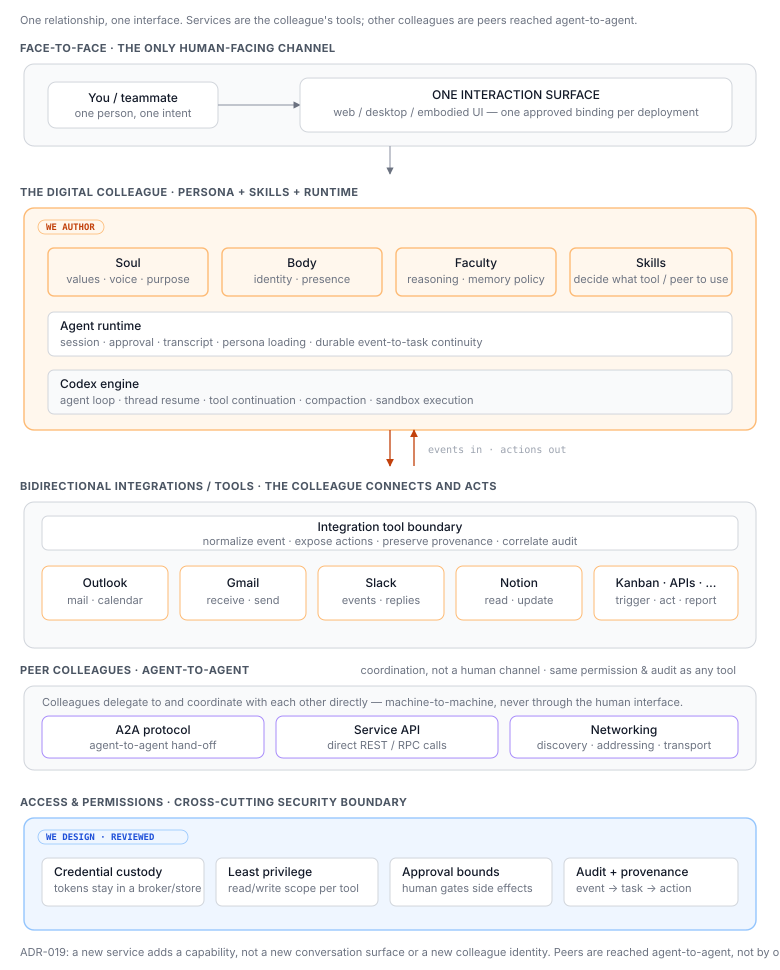

# Phase 0.5 — One face-to-face interface, many tools

**Status:** 📐 Design note. The **implementation lives in a separate code repo**
(this repo is architecture only). Parallel track — not on the cloud progression
(0 → 1 → 2 → 3).

**One line:** a digital colleague is a **layered persona running on the Codex
engine through an agent runtime**. A person meets it through one consistent
interaction surface; the colleague itself uses Outlook, Gmail, Slack, calendars,
Notion, and other services as bidirectional tools to receive and complete work.

This is deliberately not a multi-channel UX. As with a human colleague, the
relationship is face-to-face; phone, mail, chat, and work systems are tools the
colleague uses, not separate versions of the colleague that the user must learn
to operate. [ADR-019](../../decisions/ADR-019-single-interaction-surface.md)
records that boundary.

We **borrow the persona layer model** — Soul · Body · Faculty · Skill, the
"spirit" of an open-source agent framework (named in
[ADR-018](../../decisions/ADR-018-adopt-openclaw-codex.md)) — but the persona
*content*, the *skills*, the integrations, and the whole
**access-and-permission design are ours**. The framework is a design reference,
not a brand we ship and not a black-box dependency that quietly holds our
credentials.

## Goal

Prove the smallest believable digital-colleague experience:

1. A person opens one approved interface and talks to the same colleague every
   time — no channel selection or routing knowledge required.
2. The colleague knows which services it may use and chooses the appropriate
   tool from the task context.
3. Service events can create or resume work, and the colleague can act or reply
   through that same service.
4. Every inbound event and outbound action is permission-bounded and auditable.

## The stack

| Layer | Provided by | We do |
|---|---|---|
| **Interaction surface** — the one face-to-face UI | approved web/desktop/embodied client | choose one binding; keep the interaction contract stable |
| **Runtime** — sessions, approvals, transcript, persona loading | off-the-shelf agent runtime | configure it |
| **Persona** — `SOUL.md` / `IDENTITY.md`, Soul·Body·Faculty·Skill | borrowed layer model | **author it — this is the colleague** |
| **Engine** — agent loop, thread resume, tool continuation, compaction | **Codex** `app-server` | use it |
| **Integrations/tools** — Outlook, Gmail, Slack, calendar, Notion, kanban, … | vendor APIs + MCP/tool adapters | make them bidirectional and composable |
| **Access & permissions** — credentials, scopes, sandbox, approval, audit | **ours to design** | **spell it out; security reviews it** |

The colleague *is* data: a persona, skills, memory policy, and permission set.
The interface, runtime, engine, and service adapters are replaceable bindings.

## The interaction model

There is exactly one component called the **channel**: the human-facing
interaction surface. It may be implemented as a web app, desktop app, or an
embodied office UI, but a deployment presents one consistent place to meet the
colleague.

Outlook, Gmail, Slack, Teams, Linear, Notion, and calendars are **not peer
channels**. They are bidirectional integrations the colleague can operate, and
the inbound direction is **event-driven — services wake the colleague, it does
not poll them by hand.** This is a webhook job, not an MCP job (MCP is how an
agent *fetches* data mid-session; it cannot wake an agent whose session ended —
see [ADR-020](../../decisions/ADR-020-event-driven-service-integration.md)).
Reuse off-the-shelf pieces rather than build a bus:

- **Sources.** Where a service pushes natively — Microsoft Graph (Outlook),
  Google Calendar `watch()`, Gmail watch — use it. These carry a **~7-day TTL
  that must be auto-renewed**, or events silently stop. Where a service has no
  push (punch-clock, periodic summaries), a **scheduler (cron / heartbeat)**
  plays the same role, time-driven.
- **Ingress.** A small always-on **webhook receiver** (public HTTPS) verifies
  signature + source and de-duplicates. Its content is untrusted input.
- **Triage gate — a rule, not the LLM.** "Does this need agent reasoning?"
  **No → deliver-only:** forward the notice with no LLM turn (saves tokens).
  **Yes →** spawn a bounded agent session with the event as context.
- **Outcome.** The colleague acts/replies through the **same integration**
  (outbound: search, create, update, send, reply), or returns **`[SILENT]`**
  when nothing is worth interrupting a human for.
- **Continuity:** the resulting task/session is visible from the one interaction
  surface, even if nobody had it open when the event arrived.

The old "dispatcher" idea therefore becomes a small **event-to-task skill plus a
triage policy**, not a collection of channel-specific conversation services.
Event-driven and time-driven coexist and feed the same gate. The full inbound
pipeline (sources → ingress → triage → outcome) is drawn in
[integration-flow.svg](./integration-flow.svg); the main diagram shows the same
tools as the colleague's ring.

### Peer colleagues (agent-to-agent)

A third relationship, distinct from both the human interface and service tools:
colleagues coordinate with **each other** directly — delegation, hand-off, "ask
David the SA to review this" — over an **agent-to-agent protocol, a service
API, or plain networking**, machine-to-machine, **never through the human
interaction surface**. Humans meet a colleague one way (face-to-face); colleagues
reach each other a different way (peer). The single-surface rule is about the
*human* relationship — it does not mean a colleague can only ever be reached one
way.

A2A rides the **same identity, permission, and audit rules** as any tool: a peer
call is a bounded, credentialed, logged action, not a backdoor around approval.
This is a forward-looking dimension — short-term demos need only one colleague,
so it is recorded to keep the model honest, not to build now. The main diagram
deliberately shows **one colleague**; peers get drawn side by side once a second
colleague is real.

## What this replaced (and why)

Earlier Phase 0.5 drafts hand-built channel adapters around `codex app-server`.
[ADR-018](../../decisions/ADR-018-adopt-openclaw-codex.md) retired that bespoke
runtime layer. The next draft still described Gmail and Slack as parallel
channels supplied by the runtime; [ADR-019](../../decisions/ADR-019-single-interaction-surface.md)
corrects the product model: runtime capabilities may be reusable internally,
but the architecture exposes one interaction surface and treats surrounding
services as tools.

## Access & permissions

A colleague that can read mail, post to Slack, schedule meetings, and update work
systems is a real security surface:

- **Credential custody.** OAuth tokens and API keys live in a secrets store (OS
  keychain locally, a secrets manager in cloud), never in persona files, config,
  logs, or traces.
- **Least privilege.** Each integration gets the minimal read/write scopes the
  colleague needs, per colleague — never a shared god-token.
- **Inbound trust boundary.** Service content is untrusted input even when the
  sender is known. Adapters preserve provenance; skills enforce sender/resource
  allow-lists and prompt-injection controls.
- **Sandbox + approval bounds.** Sandbox policy limits reach; approval policy
  decides which writes, sends, and external side effects require a human.
- **Audit.** Every service event, tool call, approval, and outbound action records
  what happened, on whose behalf, with which permission and correlation id.
- **Runtime trust boundary.** Any runtime or broker holding real-account tokens
  is a security-review target; prefer self-hosting or a credential broker we
  control.

## Open implementation questions

- Which single interaction surface is the Phase 0.5 binding?
- For each service, is event delivery a webhook/subscription or bounded polling?
- Which operations are read-only, auto-approved writes, or human-approved writes?
- Where does the durable event/task queue live while the local device is offline?
- How are service event ids, agent sessions, approvals, and outbound actions
  correlated in the audit trail?

These are answered against the runtime and vendor APIs in the implementation
repo; they do not change the conceptual boundary above.

## Short term vs long term

- **Short term — local colleague.** One persona on a user's device, reached
  through one interface, with a small allow-listed set of integrations. The
  device supplies compute; integrations can wake work while it is online.
- **Long term — centralized colleague.** The same persona and skills run on an
  always-on runtime. The interaction contract and tool contracts stay the same;
  only deployment, durability, and scale change as the work rejoins Phase 1+.

## Where the implementation goes

A separate code repo holds the runtime config, persona files, interaction-surface
binding, event-to-task skill, service integrations, and account setup. This repo
keeps the architectural intent, diagram, and decisions
([018](../../decisions/ADR-018-adopt-openclaw-codex.md),
[019](../../decisions/ADR-019-single-interaction-surface.md),
[020](../../decisions/ADR-020-event-driven-service-integration.md)).
