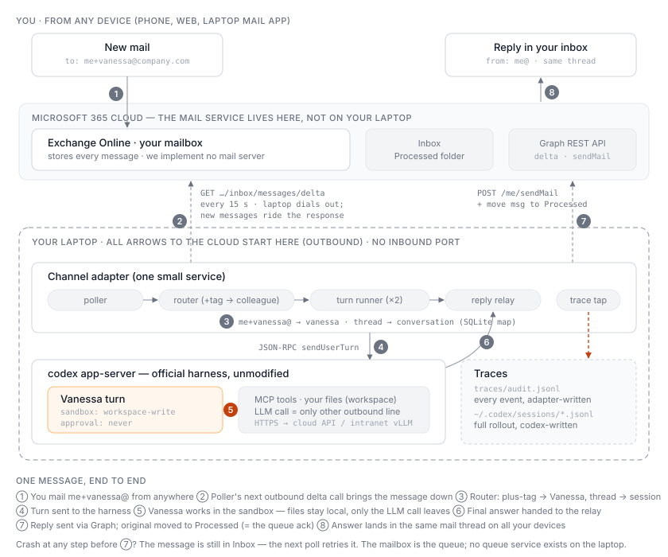
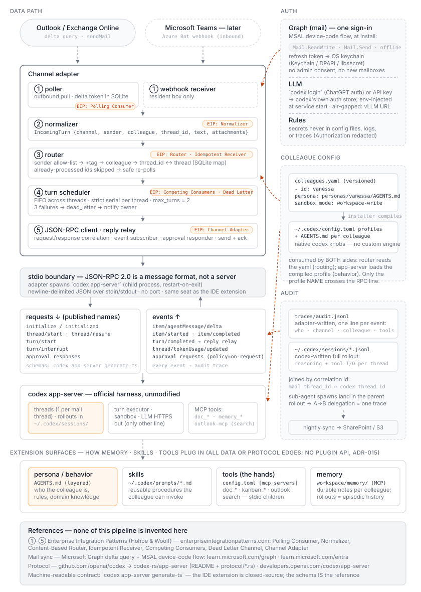

# Channel adapter — internals & configuration spec

Companion to [README.md](./README.md). This is the "many details" document: what
the adapter actually does inside, and everything a deployment must configure.
The adapter is the only component we own (ADR-015), so this file plus
`colleagues.yaml` **is** the implementation contract.

## 0. One message, end to end



Two facts this picture pins down:

- **The mail service is not on the edge.** The mailbox lives in Exchange
  Online (Microsoft's cloud). We implement no SMTP server, no MX records —
  "implementing email" means calling two Graph REST endpoints with a token:
  `GET …/messages/delta` and `POST /me/sendMail`.
- **Why polling, not event-driven push:** push requires something reachable to
  deliver the event *to*. Graph change notifications call a public HTTPS
  webhook — a laptop behind NAT has none. The outbound-held-connection
  alternative (IMAP IDLE with OAuth) buys ~seconds of latency for a second
  protocol to maintain; email's latency budget is minutes, so v0.1 takes the
  15-second delta poll. Internally the adapter is still event-driven — the
  poller merely converts "new mail in the cloud" into a local event.

**Why the channel isn't just an MCP server — MCP is the hands, not the ears.**
MCP servers are tools the agent *calls mid-turn* (pull, agent-initiated). A
channel is *ingress*: a new mail must wake the agent and start a turn, and MCP
has no "server wakes the client" mechanism. Something must notice the message,
pick the colleague, and open the turn — that irreducible job is the adapter,
and it is precisely the one gap the harness's extension surfaces (MCP,
AGENTS.md, profiles) don't cover. An **Outlook MCP server is still welcome as
a tool**: mid-turn the colleague can search old threads, read attachments,
send extra mails — channel and source connector sharing one Graph token
(ADR-009). One boundary: queue semantics (send reply + move to Processed =
the ack) stay deterministic adapter code — an LLM that forgets to ack via a
tool call would make the same mail loop forever.

**Why `app-server` and not the other codex run modes.** Codex runs five ways:
interactive TUI, `codex exec` (headless one-shot), `codex app-server`
(headless resident service speaking JSON-RPC — *not* a GUI app; "server for
apps"), the SDK, and `codex mcp-server` (codex as a tool inside another
agent). We use app-server because we need exactly its three properties:
conversation continuity across mails in a thread, the event stream (our trace
source), and the approval callback channel. Per-message `codex exec` is the
simpler alternative, but thread resume + output parsing + approvals would
grow it back into a worse app-server client.

## 1. Internal structure



**The JSON-RPC boundary, demystified.** JSON-RPC 2.0 is a *message format*
(request / response / notification as JSON objects), not a server technology.
There is nothing to host: the adapter **spawns `codex app-server` as a child
process** at boot (restart-on-exit) and exchanges newline-delimited JSON over
the child's stdin/stdout — same transport idea as MCP stdio. No port, no HTTP.
This is exactly the seat the official VS Code / Cursor extension occupies
(editor pane = its channel; extension = the JSON-RPC client; it spawns the
same child) — read the extension source as the reference client. The wire
traffic is five requests down (`initialize`, `newConversation`,
`sendUserTurn`, approval responses, `interruptConversation`) and five event
kinds up (message deltas, tool begin/end, `turn_complete`, `token_count`,
approval requests) — names representative, pinned per release (ADR-015).

A runnable skeleton of everything below lives in [`prototype/`](./prototype/)
— zero-dependency, mock mailbox + mock codex behind the real interfaces
(`python3 demo.py`).

Five loops/components sharing one small local state store:

```
┌──────────────────────────── adapter process ────────────────────────────┐
│  poller ──▶ inbox queue ──▶ router ──▶ turn runner (×N) ──▶ reply relay │
│                │                            │                            │
│                └──────── state store ◀──────┤ (JSON-RPC events)          │
│                     (SQLite, single file)   └──▶ trace writer            │
└──────────────────────────────────────────────────────────────────────────┘
```

- **Poller.** Personal mode (v0.1): **one** Graph delta query on the user's own
  mailbox (default 15 s), filtering to messages addressed to a colleague
  plus-tag; everything else is ignored. (Resident-box variant: one delta query
  per colleague mailbox.) Delta tokens are persisted, so a restart resumes
  where it left off instead of re-reading the mailbox. New messages land in
  the inbox queue as normalized `IncomingTurn` records.
- **Router.** First gate: **sender allow-list** — anyone can mail your address,
  and inbound mail is untrusted input (LLM budget, prompt injection, local file
  access). Default list is the owner alone; mail from anyone else is not
  processed, not auto-replied to (that would make the assistant a probe
  target), and logged to the trace. Several people wanting the *same* colleague
  is by definition the shared-colleague scenario → resident-box variant, not a
  reason to widen this list. Then: maps address → colleague and email thread →
  codex conversation. Personal mode routes on the plus-tag (`me+vanessa@…` →
  `vanessa`, from `colleagues.yaml`); if the tenant has plus addressing
  disabled, fallback is a subject tag (`[vanessa] …`). Threading key: Graph
  `conversationId` (falls back to `In-Reply-To`/`References`). First message of
  a thread ⇒ `newConversation` with that colleague's profile; later messages ⇒
  resume the mapped conversation.
- **Turn runner (the core).** A pool of N workers (default 2 on edge). Each
  runs one turn as a state machine (§2) over the app-server JSON-RPC
  connection: send the user turn, consume the event stream, answer approval
  requests per policy (§3), collect the final message.
- **Reply relay.** Sends the colleague's answer back via Graph `sendMail` on
  the same thread, then marks the triggering message as processed (moves it to
  a `Processed` folder — the mailbox itself is the work queue).
- **Trace writer.** Appends every JSON-RPC event to `traces/audit.jsonl` with
  the correlation id (ADR-016). Not optional, not configurable-off.

**State store** (one SQLite file — the only adapter-owned persistent state):
`delta_tokens`, `thread_map` (email thread ↔ conversation id), `processed`
(message ids, for idempotency), `inflight` (turns being run), `dead_letter`.

## 2. Message lifecycle (at-least-once, idempotent)

```
discovered → claimed → turn_running → replying → done
     ↑           │            │
     └── crash ──┴────────────┘→ retry (max 3) → dead_letter → notify owner
```

- The mailbox is the queue: a message only leaves `claimed` when the reply has
  been sent AND the message moved to `Processed`. Crash anywhere before that ⇒
  next poll re-discovers it; the `processed` table stops double-replies.
- A turn that dies mid-run (app-server restart) is retried from scratch — turns
  must therefore be **effectively idempotent**: tools that mutate external
  systems (e.g. `kanban_*`) take an idempotency key derived from the message id.
- After 3 failures the message goes to `dead_letter` and the adapter emails the
  *requester* ("Vanessa couldn't process this; her operator has been notified")
  and the *operator* (owner address in config). No silent drops, ever.
- Per-conversation serialization: one turn at a time per thread; parallel
  threads to the same colleague are fine (sessions are cheap, ADR-015).
- Ordering: FIFO across threads by `receivedDateTime`, best-effort only —
  what must be strict is the *within-thread* serialization above. Global
  ordering and priorities are deliberately not built (YAGNI for email
  latency); `max_turns` (default 2) bounds concurrency device-wide.

## 3. Approval policy — native knobs, not a custom engine

Codex already has two orthogonal, per-profile controls: `sandbox_mode`
(`read-only` / `workspace-write` / `danger-full-access`) bounds what the agent
*can touch*, and `approval_policy` (`untrusted` / `on-failure` / `on-request` /
`never`) decides *when it asks a human*. We do *not* build an allow-list engine
on top (that would violate ADR-015); each colleague declares a native pair in
`colleagues.yaml` and the installer compiles it into their config.toml profile:

- **Advisor colleagues (v0.1 default):** `workspace-write` + `never` — free to
  act inside the sandbox, never blocks waiting for an approval nobody will see.
  The sandbox, not an approval prompt, is the safety boundary.
- **Read-only colleagues:** `read-only` + `never` — for pure Q&A personas.
- **Operator colleagues (v0.2):** `workspace-write` + `on-request` — the only
  case where the adapter handles approval callbacks: it emails the requester
  "Vanessa wants to run X — reply APPROVE" and resumes the turn on approval.
  Every approval exchange lands in the trace.

Exact mode names are pinned per codex release along with the binary (ADR-015).

## 4. Configuration surface — everything a deploy must provide

Two files plus a secrets layer. The installer materializes all of it.

**`adapter.toml`** (non-secret; per device):

```toml
[graph]
tenant_id   = "…"
auth        = "device_code"        # edge default; "client_credentials" on resident box
poll_seconds = 15

[runtime]
codex_bin    = "/usr/local/bin/codex"   # pinned version (ADR-015)
max_turns    = 2                        # concurrent turn workers
workspace    = "~/DigitalColleagues"    # where colleagues read/write files

[llm]                                   # what codex config.toml gets pointed at
provider  = "azure_openai"              # or "openai" | "internal_vllm"
base_url  = "https://…"                 # required for azure/vllm

[traces]
dir       = "~/DigitalColleagues/traces"
sync      = "sharepoint"                # or "s3" | "none" (air-gapped: none + manual)
sync_url  = "https://…"

[policy]
allowed_senders = ["you@company.com"]   # who may trigger turns; default: owner only

[operator]
email = "you@company.com"               # dead-letter + health notifications
```

**`colleagues.yaml`** (identity of record — version-controlled, shared):

```yaml
colleagues:
  - id: vanessa                         # personal mode: reached at me+vanessa@…
    persona: personas/vanessa/AGENTS.md
    tools: [docs-v1, kanban-v1]         # MCP allow-list
    sandbox_mode: workspace-write       # native codex knobs (§3)
    approval_policy: never
    model: gpt-5.2                      # per-colleague override allowed
```

**Secrets — three kinds, none in files:**

| Secret | Obtained | Stored |
|---|---|---|
| Graph token (personal mode: **one**, for the user's own mailbox) | device-code sign-in during install | OS keychain (Keychain / DPAPI / libsecret) |
| LLM credential (`OPENAI_API_KEY` / Azure key, or ChatGPT login) | `codex login` or key paste during install | codex's own auth store / keychain; injected as env at service start |
| MCP tool credentials (e.g. kanban API) | install prompts, per tool | OS keychain |

Rules: secrets never appear in `adapter.toml`, `colleagues.yaml`, logs, or
traces (trace writer redacts `Authorization` fields). Air-gapped deploys point
`[llm]` at internal vLLM — no key leaves the network, possibly none at all.

**Graph auth model — the one real IT decision:**

- **Edge / personal (v0.1): delegated, device-code, one sign-in.** The adapter
  only ever touches the user's own mailbox (colleagues are plus-tags on it),
  so install runs a single device-code sign-in as the user. Scopes:
  `Mail.ReadWrite`, `Mail.Send`, `offline_access`. No admin consent, no new
  mailboxes provisioned — deployable without any platform-team involvement.
- **Resident box (v0.2+): application permissions.** One app registration,
  client credential on one managed machine, scoped by `ApplicationAccessPolicy`
  to exactly the colleague mailboxes. Cleaner, but needs tenant-admin consent —
  which is why it is not the v0.1 path.
- Rejected: client credentials distributed to every laptop (secret sprawl).

**Mailbox setup — there is none.** A plus address is a receiving-side
convention, not an object: Exchange Online (default-on since ~2022) and Gmail
deliver `victor+anything@` straight to `victor@`'s inbox with the tag intact in
the To: field. No new mailbox, no alias, no admin-center visit. If the tenant
has it disabled: ask IT for one line
(`Set-OrganizationConfig -AllowPlusAddressInRecipients $true`) or use the
subject-tag fallback. One honest limitation: replies go out via
`POST /me/sendMail`, so the From: is the owner's own address — the colleague's
identity shows as thread + signature + optional `[Vanessa]` subject prefix. A
real distinct From (`vanessa@company.com`) requires a real mailbox, which is
shared-colleague / ADR-010-full territory, not personal mode.

## 5. Install flow (what the installer actually does)

1. Install pinned `codex` binary + adapter binary
2. Read `colleagues.yaml` → write `~/.codex/config.toml` profiles + personas
3. Prompt: LLM credential (`codex login` / API key) → keychain
4. Graph device-code sign-in as the user (one sign-in covers all colleagues) → keychain
5. Write `adapter.toml`; create workspace + traces dirs
6. Register services (launchd / systemd / Task Scheduler): `codex app-server`
   and the adapter, restart-on-crash, start-on-boot
7. Smoke test: mail `me+<colleague>@…` for each colleague → expect reply + both
   trace layers correlated; print result

Uninstall reverses it (services, keychain entries, optionally data dirs).

## 6. Failure modes summary

| Failure | Behavior |
|---|---|
| Device asleep | Colleague offline; mail queues in mailbox; drains on wake |
| app-server crash | OS restarts it; in-flight turns retried via §2; history in rollouts |
| Adapter crash | OS restarts; delta token + processed table resume cleanly |
| Graph token expired | Adapter emails operator; colleague auto-replies "temporarily offline" if mail still readable, else silent until re-auth |
| LLM endpoint down | Retry with backoff within the turn; then §2 retry path |
| Poison message (always crashes turn) | 3 strikes → dead_letter → both parties notified |
