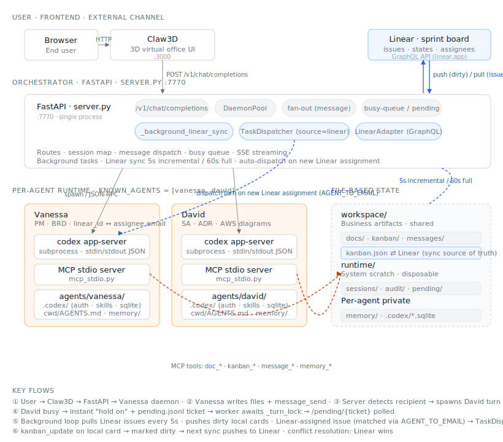

# Phase 0 — Prototype

**Status:** ✅ Running. In use by the legal team (manually, low volume).

**Code repo:** `prjt-digital-staff` (Azure DevOps)

## Goal

Prove that the "digital colleague" concept works end-to-end on a single machine,
with the lowest possible infrastructure cost, before committing to cloud architecture.

## Architecture

Single FastAPI process. Two hardcoded colleagues (Vanessa = PM, David = SA). Each
colleague is a long-running `codex app-server` subprocess managed by a `DaemonPool`.
All shared state — documents, kanban, messages — lives as JSON/JSONL files on disk.
Frontend is the Claw3D 3D virtual office.

**Linear integration (optional, enabled by `LINEAR_API_KEY` + `LINEAR_TEAM_ID`).**
A background task in `server.py` performs **bidirectional sync** between the local
`workspace/kanban/kanban.json` and a Linear team's sprint board: 5-second incremental
sync (pushes dirty local cards + pulls Linear issues), 60-second full sync (catches
deletions). Linear-assigned issues — matched to a local colleague via the
`AGENT_TO_EMAIL` map — are auto-dispatched as turns by `TaskDispatcher` (source =
`linear`). This makes Linear the **secondary task ingress** alongside Claw3D, and
the team's sprint board doubles as the cross-colleague kanban view that non-3D-savvy
stakeholders (e.g. legal) can use. Conflict resolution: Linear wins.

## What works well

- **Zero infrastructure.** One process, one filesystem. Easy to run on a laptop or a single EC2.
- **File-based collaboration is surprisingly capable.** `workspace/messages/messages.jsonl`
  + a fan-out trigger is enough to make two colleagues coordinate.
- **Busy queue (`pending.jsonl`) is well-designed** — the `queued → running → done` state
  machine with atomic claim survives restarts and won't double-process.

## What won't survive into Phase 1

- **Single FastAPI process is the SPOF.** No HA, no horizontal scale.
- **File-based state means single host.** Can't run two workers safely.
- **Per-agent long-lived subprocess.** Doesn't scale beyond ~10 colleagues per host;
  no way to autoscale; restart loses thread context.
- **Hardcoded `KNOWN_AGENTS`.** Adding a colleague requires code change + redeploy.
- **No auth, no tenancy, no RBAC.** Fine for one team, not for enterprise.

## What we want to keep

- The **fan-out trigger pattern** (server detects `message_send` → spawns recipient turn)
- The **busy-queue state machine** — translates directly to SQS-based architecture
- The **Claw3D UX** — 3D office is the differentiator, not a throwaway
- The **MCP tool layer** — `doc_*`, `kanban_*`, `message_*`, `memory_*` are the right
  abstraction; the implementation behind them just gets swapped out
- The **persona-as-data approach** (`agents/<id>/cwd/AGENTS.md` + `memory/`)
- The **Linear-as-control-plane pattern** — issue assignment triggers an agent turn.
  This is exactly the right model to keep in Phase 1+ (replace polling sync with
  Linear webhook → orchestrator → SQS, same semantics)

## Migration path

See [Phase 1](../1/) for the next step.
