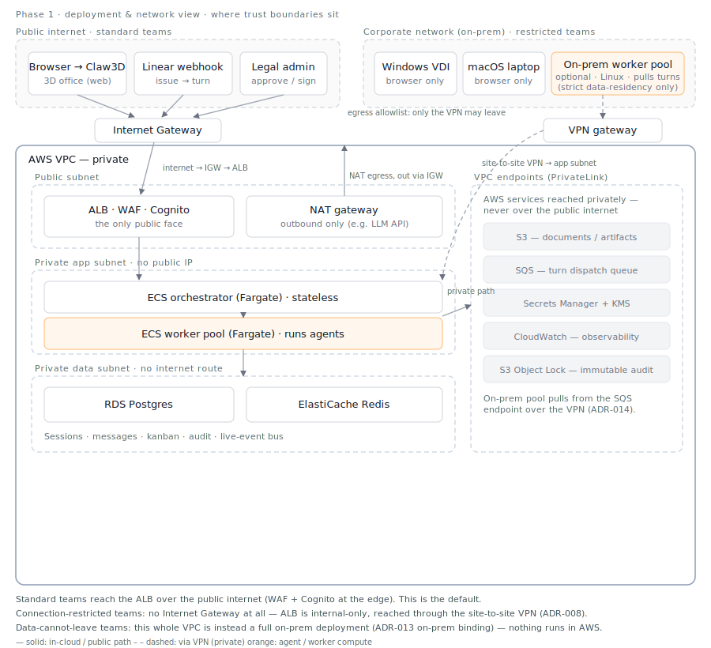

# Phase 1 — Legal MVP

**Status:** 🚧 In design. Target ship: ~2 months from repo creation.

**Scope:** One scenario only — **legal contract review**. One channel — Claw3D + Linear.
One team — legal. Multi-colleague but small (3–5 personas).

> This phase is the **AWS binding** of the
> [logical architecture](../../overview/logical-architecture.md). The AWS services below
> (RDS, S3, SQS, Fargate, …) are *implementations* of capability components (Persona store,
> Dispatch queue, Worker pool, …); the same capabilities can bind on-prem — see
> [ADR-013](../../decisions/ADR-013-capability-oriented-logical-architecture.md).

## Goal

Ship a production-ready system that the legal team can rely on for daily contract
review work. Production-ready means: hosted on AWS, no SPOF on the worker layer,
auditable, recoverable, and able to be operated without the original developer present.

## Non-goals for Phase 1 (deferred to later phases)

- Multi-team / multi-tenant — single team workspace is fine
- Channels beyond Claw3D + Linear — no Slack/Teams/Email yet
- 1000-agent scale — design for ~20 concurrent colleague turns
- Multi-region / DR — single AWS region, accept ~1hr RTO

## Architecture (sketch — to be diagrammed)

- **Orchestrator API** (ECS Fargate, autoscaled) — replaces `server.py`, stateless
- **Worker pool** (ECS Fargate, queue-driven) — replaces per-agent subprocesses
- **SQS** for turn dispatch — direct port of Phase 0 `pending.jsonl` semantics
- **RDS Postgres** for sessions, audit, kanban, message log
- **S3** for documents (contracts) and large artifacts
- **Secrets Manager + KMS** for per-colleague codex/LLM credentials
- **Linear webhook** as the second ingress (issue → turn)
- **CloudTrail + immutable audit log** for legal compliance story

This is the **component / flow view** — what the pieces are and how a turn moves between them.

### Deployment & network view

The component view above deliberately says nothing about network trust boundaries. That's a
separate concern, so it's a separate diagram — where things sit relative to the public internet,
the VPC, its subnets, and the corporate network.

Three network situations, same components:

1. **Standard teams** (default) — reach the ALB over the public internet through an **Internet
   Gateway**; WAF + Cognito at the edge. The orchestrator/workers live in private subnets with no
   public IP; their outbound traffic (e.g. an LLM API) leaves via a **NAT gateway**, which itself
   egresses through the Internet Gateway. Data stores have no internet route; AWS services (SQS,
   S3, Secrets) are reached through **PrivateLink VPC endpoints**, not the public internet.
   (IGW = the door to the internet; NAT = outbound-only for private subnets; VPC endpoint = reach
   AWS services with no internet at all.)
2. **Connection-restricted teams** — the data may transit encrypted, but nothing should cross the
   public internet. The ALB becomes internal-only and is reached through a **site-to-site VPN**;
   desktops (Windows VDI / macOS) are browser-only, so the OS doesn't matter ([ADR-008](../../decisions/ADR-008-vdi-presentation-only-channel.md)).
   This is the meaning of "private VPC + VPC endpoints + site-to-site VPN + egress allowlist."
3. **Data-cannot-leave teams** — the strictest case. The whole VPC is instead a **full on-prem
   deployment** ([ADR-013](../../decisions/ADR-013-capability-oriented-logical-architecture.md)
   on-prem binding); an on-prem Linux worker pool pulls turns over the VPN
   ([ADR-014](../../decisions/ADR-014-worker-pool-placement.md)). Nothing runs in AWS.

Which situation applies is a question for IT/legal, not an architecture choice — see
[ADR-008](../../decisions/ADR-008-vdi-presentation-only-channel.md). "Network-private" (situations
1–2) and "physically not in the cloud" (situation 3) are different requirements; don't conflate them.

## Key design decisions (ADRs)

- [ADR-002](../../decisions/ADR-002-fargate-not-eks.md): Fargate vs EKS — why we're not doing Kubernetes yet
- [ADR-003](../../decisions/ADR-003-linear-as-control-plane.md): Linear as control plane for task dispatch
- [ADR-004](../../decisions/ADR-004-worker-pool-externalized-state.md): Worker pool with externalized state vs per-agent containers
- [ADR-005](../../decisions/ADR-005-human-in-the-loop-gates.md): Human-in-the-loop gates for contract output
- [ADR-006](../../decisions/ADR-006-audit-log-retention.md): Audit log storage and retention for legal compliance
- [ADR-007](../../decisions/ADR-007-symphony-inspired-orchestration.md): Symphony-inspired claim-state
  machine, workflow-as-data colleague config, and bounded continuation turns — informs ADR-004
- [ADR-011](../../decisions/ADR-011-alb-not-api-gateway.md): ALB + orchestrator as the gateway, not API Gateway
- [ADR-012](../../decisions/ADR-012-streaming-return-path.md): worker → orchestrator streaming return path (Redis Pub/Sub)

## Migration from Phase 0

- `workspace/messages/messages.jsonl` → Postgres `messages` table
- `workspace/kanban/kanban.json` → Postgres `kanban_cards` table
- `workspace/docs/` → S3 bucket (with KMS encryption), as the **default** source connector for
  content we originate — if a team's contracts actually live in SharePoint, `doc_*` tools resolve
  through a SharePoint connector instead; see [ADR-009](../../decisions/ADR-009-source-connectors-distinct-from-channels.md)
- `runtime/pending/pending.jsonl` → SQS queue + Postgres `pending_tickets` table
- `agents/<id>/.codex/` → Secrets Manager + per-colleague config in DB
- `KNOWN_AGENTS` list → `colleagues` table

The MCP tool layer (`doc_*`, `kanban_*`, etc.) keeps its interface — only the
backing storage changes. This means the codex agent prompts don't need to change.
