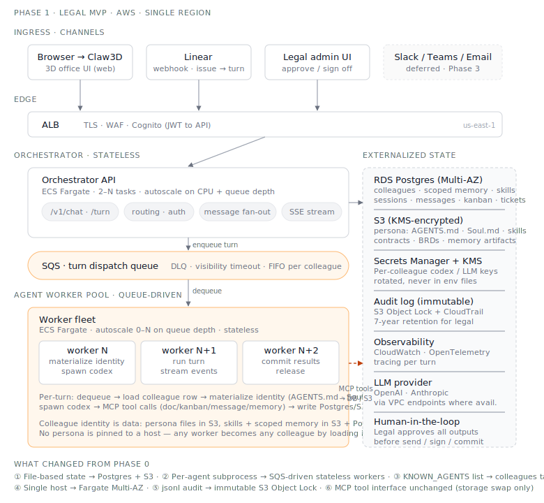

# Phase 1 — Legal MVP

**Status:** 🚧 In design. Target ship: ~2 months from repo creation.

**Scope:** One scenario only — **legal contract review**. One channel — Claw3D + Linear.
One team — legal. Multi-colleague but small (3–5 personas).

## Goal

Ship a production-ready system that the legal team can rely on for daily contract
review work. Production-ready means: hosted on AWS, no SPOF on the worker layer,
auditable, recoverable, and able to be operated without the original developer present.

## Non-goals for Phase 1 (deferred to later phases)

- Multi-team / multi-tenant — single team workspace is fine
- Channels beyond Claw3D + Linear — no Slack/Teams/Email yet
- 1000-agent scale — design for ~20 concurrent colleague turns
- Multi-region / DR — single AWS region, accept ~1hr RTO

## Architecture (sketch — to be diagrammed)

- **Orchestrator API** (ECS Fargate, autoscaled) — replaces `server.py`, stateless
- **Worker pool** (ECS Fargate, queue-driven) — replaces per-agent subprocesses
- **SQS** for turn dispatch — direct port of Phase 0 `pending.jsonl` semantics
- **RDS Postgres** for sessions, audit, kanban, message log
- **S3** for documents (contracts) and large artifacts
- **Secrets Manager + KMS** for per-colleague codex/LLM credentials
- **Linear webhook** as the second ingress (issue → turn)
- **CloudTrail + immutable audit log** for legal compliance story

## Key design decisions to capture as ADRs

- ADR-002: Fargate vs EKS — why we're not doing Kubernetes yet
- ADR-003: Linear as control plane for task dispatch
- ADR-004: Worker pool with externalized state vs per-agent containers
- ADR-005: Human-in-the-loop gates for contract output
- ADR-006: Audit log storage and retention for legal compliance

## Migration from Phase 0

- `workspace/messages/messages.jsonl` → Postgres `messages` table
- `workspace/kanban/kanban.json` → Postgres `kanban_cards` table
- `workspace/docs/` → S3 bucket (with KMS encryption)
- `runtime/pending/pending.jsonl` → SQS queue + Postgres `pending_tickets` table
- `agents/<id>/.codex/` → Secrets Manager + per-colleague config in DB
- `KNOWN_AGENTS` list → `colleagues` table

The MCP tool layer (`doc_*`, `kanban_*`, etc.) keeps its interface — only the
backing storage changes. This means the codex agent prompts don't need to change.
