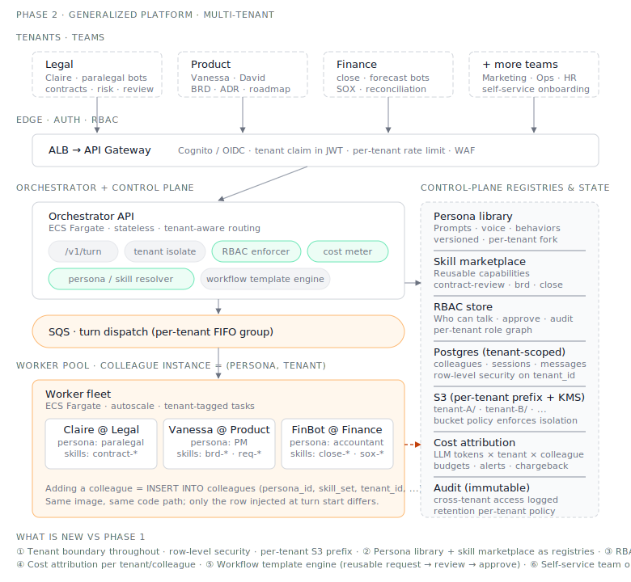

# Phase 2 — Generalized Platform

**Status:** ⏳ Planned. Begins after Phase 1 is in production.

## Goal

Take the legal-specific MVP and generalize it into a platform that supports any
business scenario: product management, system architecture, finance close, marketing
content, customer support — anything where a digital colleague pattern fits.

## What changes vs Phase 1

- **Multi-tenant workspaces.** Each team has its own colleagues, docs, kanban.
- **Persona library + skill marketplace.** Adding a colleague = picking persona + skill bundle, not deploying code.
- **RBAC.** Who can talk to which colleague, who can approve their output, who can see the audit log.
- **Workflow templates.** Common patterns (request → review → approve → notify) as reusable building blocks.
- **Per-tenant cost attribution** — track LLM spend by team / by colleague / by scenario.

## Hard problems to solve here

- **Cross-tenant data isolation** — colleagues must never leak one tenant's data into another's session
- **Skill composition** — when colleagues from different teams need to collaborate (legal + product), how does access work
- **Memory scope** — is memory per-colleague, per-team, per-tenant? All three at different layers
- **Onboarding** — non-technical teams should be able to spin up their own colleagues without engineering involvement

## What stays the same from Phase 1

The orchestrator + worker pool + SQS + Postgres + S3 backbone doesn't change shape.
This phase is mostly about **abstractions on top**, not new infrastructure.
