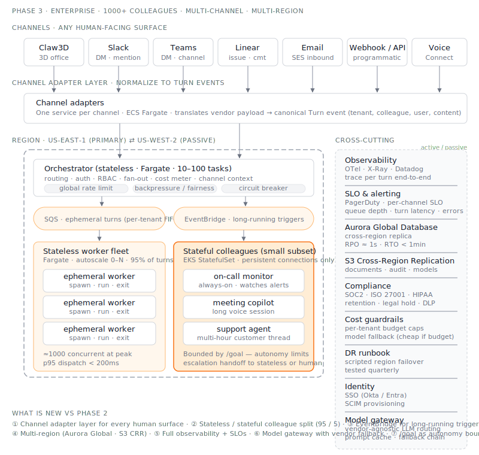

# Phase 3 — Enterprise & Multi-Channel

**Status:** ⏳ Planned. The robust, scale-out version.

## Goal

Run 1000+ digital colleagues across a 1000+ person company, reachable from any
channel employees already use, with HA, observability, compliance, and cost
controls a real enterprise needs.

## Scale targets

- 1000+ active colleagues
- 10k+ concurrent turns at peak
- 100k+ turns/day
- p95 turn latency < acceptable threshold (TBD per scenario)
- 99.9% control-plane availability

## Channels

Each colleague is reachable from any of these — same identity, same memory:

- Claw3D 3D office (the differentiator, kept)
- Slack (DM, channel mention, slash command, modal)
- Microsoft Teams (chat triggers)
- Linear (issue assignment, comment)
- Email (inbound + outbound)
- Webhook / API (for programmatic callers)
- VDI-bound desktops (presentation-only — see [ADR-008](../../decisions/ADR-008-vdi-presentation-only-channel.md))
- Voice / phone (future)

**Key insight:** channels are thin adapters in front of the same orchestrator.
The colleague doesn't know which channel they're being reached on, except as metadata.

**Channels are not document sources.** Where a document actually lives (S3, SharePoint, a DMS)
is a separate concern handled by **source connectors**, not channel adapters — see
[ADR-009](../../decisions/ADR-009-source-connectors-distinct-from-channels.md). Microsoft Teams,
for example, is a channel adapter for chat and a source connector for files at the same time —
they share Graph API auth, not architecture.

## What gets added vs Phase 2

- **Channel adapter layer** — one service per channel, normalized event shape
- **Per-channel ingress queues** — backpressure isolation
- **Long-running colleagues** — for the small subset that needs persistent state
  (e.g. on-call monitor, always-on assistant), introduce a stateful runtime
  (probably k8s StatefulSet for *those few*, not all)
- **Observability stack** — distributed tracing across orchestrator → worker → tool calls
- **Compliance** — SOC2, ISO 27001, legal hold, data retention policies as code
- **Cost guardrails** — per-tenant LLM spend budgets, autoscale ceilings, alarms
- **Multi-region** — at least active/passive for DR

## What we explicitly avoid

- A microservice for every colleague — colleagues are data, not services
- Service mesh between agents — the orchestrator is the integration point
- Custom-built channel implementations when vendor SDKs are good enough

## Open questions

- Stateful vs stateless colleagues — split the population, or one model fits all?
- Agent-to-agent calling at scale — does the file-based pattern still work, or do we need something more like a real RPC layer?
- How does `/goal` integrate as the autonomy boundary for long-running colleagues?
