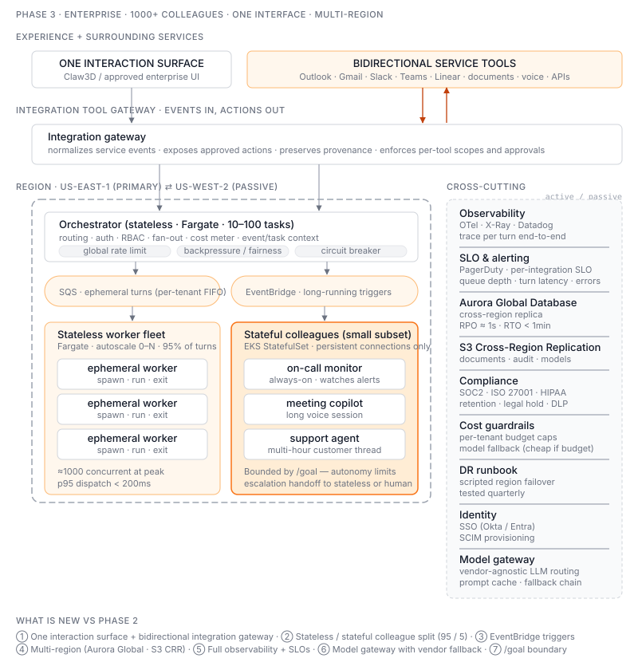

# Phase 3 — Enterprise Reach & Resilience

**Status:** ⏳ Planned. The robust, scale-out version.

## Goal

Run 1000+ digital colleagues across a 1000+ person company through one consistent
interaction surface, while each colleague can receive work from and act through
enterprise services with the HA, observability, compliance, and cost controls a
real enterprise needs.

## Scale targets

- 1000+ active colleagues
- 10k+ concurrent turns at peak
- 100k+ turns/day
- p95 turn latency < acceptable threshold (TBD per scenario)
- 99.9% control-plane availability

## Interaction surface and integrations

Each deployment presents **one approved human-facing surface** — for example the
Claw3D office, a web client, or an enterprise desktop shell. Employees do not pick
a vendor channel before talking to a colleague.

Each colleague can use permission-scoped, bidirectional integrations:

- Outlook / Gmail — message events, search, send, reply, calendar actions
- Slack / Microsoft Teams — message events, read context, post or reply
- Linear / kanban — assignment and comment events, issue/status updates
- SharePoint / Google Drive / DMS — document discovery, read, create, update
- Webhooks / APIs — system events and approved business actions
- Voice / phone — future communication tool, not a second agent identity

**Key insight:** a new service adds something the colleague can observe or do; it
does not add another way the user must operate the colleague. Service events and
tool actions share the same identity, permission, approval, and audit boundary.
See [ADR-019](../../decisions/ADR-019-single-interaction-surface.md).

## What gets added vs Phase 2

- **Integration tool gateway** — one contract for inbound events and outbound actions
- **Per-integration event queues** — backpressure and failure isolation without changing the UX
- **Long-running colleagues** — for the small subset that needs persistent state
  (e.g. on-call monitor, always-on assistant), introduce a stateful runtime
  (probably k8s StatefulSet for *those few*, not all)
- **Observability stack** — distributed tracing across orchestrator → worker → tool calls
- **Compliance** — SOC2, ISO 27001, legal hold, data retention policies as code
- **Cost guardrails** — per-tenant LLM spend budgets, autoscale ceilings, alarms
- **Multi-region** — at least active/passive for DR
- **Federated worker pools by location** — a cloud pool plus, where data sovereignty requires it,
  an on-prem Linux pool inside the corporate network; edge pools pull work outbound, are never
  called into; agents never run on end-user machines. See [ADR-014](../../decisions/ADR-014-worker-pool-placement.md)

## What we explicitly avoid

- A microservice for every colleague — colleagues are data, not services
- Service mesh between agents — the orchestrator is the integration point
- Custom-built service transports when vendor SDKs are good enough

## Open questions

- Stateful vs stateless colleagues — split the population, or one model fits all?
- Agent-to-agent calling at scale — does the file-based pattern still work, or do we need something more like a real RPC layer?
- How does `/goal` integrate as the autonomy boundary for long-running colleagues?
