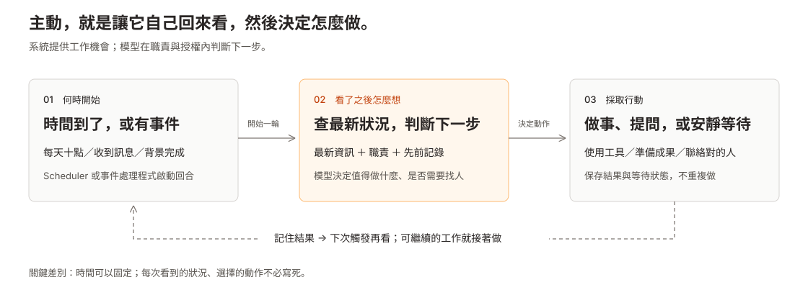

# 數位同事研究：主動工作與同事互動感

[開啟新版研究站](index.html) · 更新：2026-09-11

主線：Time／Event → 框架實作 → 原架構與 W0–W7 → 三個主動性 Phase → 國泰情境與觀測。完整畫面安排見 [Story line](storyline.md)，技術與來源見 [實作導讀](source-notes/initiative-implementation-guide.md)。

| 閱讀順序 | 看什麼 | 入口 |
|---|---|---|
| 01 Time／Event | 人與 Agent 同屏；喚醒、持續執行、選題分層 | [直接對照](index.html#human) |
| 02 框架實作 | Polling、Heartbeat、Cron、Event、Voyager：介面與實際路徑 | [機制互動圖](index.html#frameworks) |
| 03 我們的架構 | 原圖 Before／After、hover 展開、W0–W7 與缺口 | [架構工作台](index.html#architecture) |
| 04 三個 Phase | 固定節律 → 目標驅動 → 自主跟進；框架 × 技術矩陣 | [Phase 對照](index.html#phases) |
| 05 國泰情境與驗證 | 四職能 × 三階段；正常靜默、失效、品質與穩定性 | [情境與觀測](index.html#verification) |
| 延伸 Interaction | 回應、修正、等待、交接的同事感 | [互動實驗室](show-me-colleague-interaction.html) · [同事的一天](visual-story.html) |
| 資料 Library | 五個主題、完整搜尋、Markdown 正文與引用 | [研究書架](library.html) |

視覺採用使用者指定的 Cream 方向，首頁、互動頁與同事的一天使用改編的 unDraw 插畫；原創 SVG 僅保留為歷史素材。人物、對話與 demo 是說明用情境，不代表後端執行結果。認知研究、固定版本程式、官方描述、非官方重建與專案提案分開標明。

## 主動工作：機制不神祕

**時間／事件 → 觀察 × 職責／記憶 → 想到值得做的工作 → 選擇與授權 → 行動或不行動。**

例如上午十點看專案，發現下午要用的檔案還沒有完成證據，就找 Alex 確認；若已完成，就整理成果；若剛問過，就繼續等待。時間可以固定，動作不必寫死。

進階機制需要說明增加了什麼：變化比對省模型成本、動態間隔調整查看時間、completion 接續未完工作、評估器檢查完成、curriculum 選下一個任務。這些不等於另一種無來源的喚醒。[完整查核](source-notes/proactive-trigger-mechanisms.md)

## 同事互動感：讓合作接得下去

**理解誰在等什麼 → 適當回應與行動 → 保留共同脈絡。**

接手要有交代、改方向能生效、群組裡不亂插話、交接後知道在等誰、做完把成果交到人手上。這可以獨立於排程研究；訊息多，不代表像同事。[完整設計與驗收](colleague-interaction.md)

## 往下展開

| 閱讀深度 | 內容 |
|---|---|
| 高層概念 | [視覺化入口](index.html)、兩條主線的互動情境 |
| 設計與取捨 | [主動工作](proactive-work.md)、[同事互動](colleague-interaction.md) |
| 共用基礎 | [記憶、責任、證據與工作閉環](source-notes/colleague-experience.md)、[承諾跟進](source-notes/commitment-followup-design.md) |
| 框架與原始碼 | [完整技術研究展開](show-me-proactive-lifecycle.html#frameworks)、[來源索引](source-notes/README.md) |
| 歷史與查核 | [OpenClaw commitments 退役](source-notes/openclaw-inferred-commitments.md)、各固定版本 notes 與 validation |

## 文件怎麼整理

- `index.html`、本 README：兩條研究主線的入口。
- `proactive-work.md`、`show-me-proactive-lifecycle.html`：主動工作，HTML 先概念、細節可展開。
- `colleague-interaction.md`、`show-me-colleague-interaction.html`：同事互動感。
- `source-notes/`：來源、共用設計、歷史與驗證，保留固定網址避免既有引用失效。
- `mechanism-flows/`、`sequence-diagrams/` 與既有 SVG：技術圖素材，由詳細研究頁連入。
- 舊 `proactive-research-summary.md` 與舊 HTML 入口繼續導向新主線，不再維護另一份平行總結。

這次調整研究組織與呈現，不修改既有 phase／ADR。官方描述、已讀原始碼、非官方重建與本專案提案分開標示；各歷史 validation 只證明當時的檢查範圍。

## 從概念往下看

- [人如何想起，Agent 如何實踐](index.html#human)：圖像導覽從人的行為開始。
- [完整機制圖譜](mechanisms.html)：七個框架、39 個機制／證據邊界，直接在前端深入流程、分支、時序與來源。
- [認知科學依據與工程對照](source-notes/human-to-agent.md)。

## 完整研究前端

[閱讀全部研究](library.html)：依五個主題瀏覽正文、全文搜尋、章節目錄、圖表、程式碼與固定來源。各情境的研究連結也通往前端閱讀頁。

研究來源以 Markdown 維護；靜態閱讀頁由 `tools/build_reading.py` 產生。更新來源後，使用獨立 Python 環境安裝 `tools/requirements.txt`，再執行 `python research/tools/build_reading.py`。瀏覽端不需要套件或建置服務。
