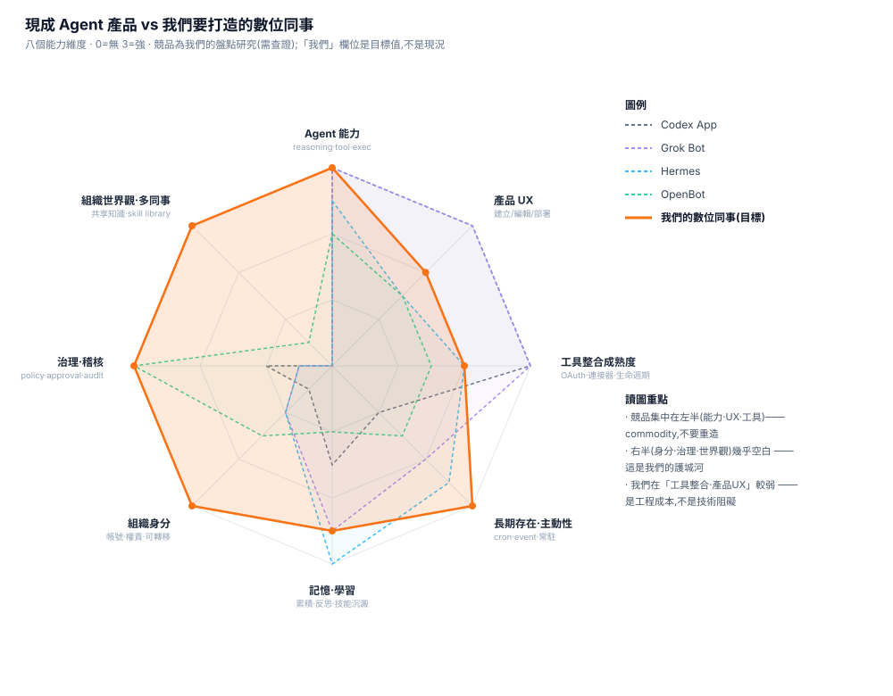

# 數位同事 Overview:能做什麼、缺什麼、我們的邊界

**一頁看懂:** Codex App 已經能做什麼 → 缺什麼 → 我們的護城河與邊界 → 完整比較表。
**細節文件:** [產品方向報告](./digital-colleague-direction.zh-TW.md) ·
[英文能力盤點](./agent-product-landscape.md)



> 競品集中在**左半（能力·UX·工具）** —— 那是 commodity,不要重造。
> **右半（身分·治理·組織世界觀）幾乎空白** —— 那是我們的護城河。
> 而我們在**工具整合與產品 UX 較弱** —— 這是選自組合要付的帳（見第五節,是工程成本不是阻礙）。

---

## 一、Codex App 已經能做什麼

**對 BU 來說,它已經是一個夠好的個人工作平台。** 主管說「BU 用它就能自動化流程」是對的:

| 能做 | 說明 |
|---|---|
| Interactive knowledge work | 文件分析、Research、寫作、寫小工具 |
| **Skills** | 使用者自己教它一套做法,之後重複用 |
| **Automation** | GUI 設定的排程／觸發自動化 |
| **Computer Use** | 直接操作電腦 |
| **成熟的工具串接** | 連接器、OAuth 流程、MCP 生命週期都產品化了 |
| Projects / Diff / Review UX | 多專案、看 agent 改了什麼 |
| 穩定 | **內含配對測過的 app-server,版本不會漂**（見第四節） |

---

## 二、Codex App 缺什麼（＝我們的空間）

| 缺什麼 | 為什麼 BU 場景遲早會撞到 |
|---|---|
| **組織身分** | 它是「某個人的工具」。人離職,它的 skill／設定就跟著走 |
| **權責歸屬與稽核鏈** | 出事要能答「誰授權的、憑什麼權限、誰覆核」—— 它給 log,不給合規要的證據鏈 |
| **不經人發起的長期存在** | 要有人開著、有人按。半夜進來的合約沒人處理 |
| **跨系統的單一角色** | 每個 app 各自的 copilot;沒有「一個同事、一份記憶、一條軌跡」 |
| **組織知識累積** | 每個人自己存 prompt;不會變成組織資產 |
| **Mentor→漸進自主** | 二元的:要嘛你按、要嘛自動;沒有「逐步交付信任」 |
| **多同事與共享世界觀** | 沒有「政策更新一次,所有同事同步」 |

> **一句話:Codex App 解「個人生產力」,我們解「組織僱用 AI 同事」。**
> 兩者互補,不是二選一。

---

## 三、我們的邊界與護城河

### 產品邊界

```text
我們的產品：數位同事
  Identity · Skill · Governance · Evaluation · Lifecycle · BU Self-service
        ↑ 使用（不自研,持續汰換）
供應商層
  OpenClaw → 同事「如何存在」   Codex → 同事「如何完成工作」
```

### 老闆的四個賽道 ＝ 我們的 roadmap

| 賽道 | 內容 | 現成可借 |
|---|---|---|
| **記憶** | 跨 session／跨案子的累積 | Hermes 的 memory 模型 |
| **技能學習** | 糾正 → 沉澱成 skill → 重用 | Hermes 的 learning loop |
| **自主性** | mentor 帶訓 → 漸進自主 | **無人做得好 —— 我們的設計空間** |
| **企業組織世界觀** | 共享的組織知識、政策、誰是誰 | OpenBot 的治理形狀 |

**這四條的共同點:全部都是「會累積」的東西。** 這正是護城河的定義 ——
**廠商賣能力,我們累積組織的身分、知識與信任。**

### 護城河分級（誠實版）

| 等級 | 內容 |
|---|---|
| **真護城河** | 累積的組織知識 · 跨系統單一角色 · 可稽核的權責鏈 |
| **6–12 個月領先** | mentor→漸進自主（機制可被抄,**已累積的帶訓成果抄不走**） |
| **不要當賣點** | 組織身分（部分廠商已在做 agent service account） |

### 關於「擬人化」

老闆的賣點是擬人化 —— **這是對的,而且要做好,但要有裡子撐著**:

| 層次 | 內容 | 定位 |
|---|---|---|
| **形象**（名字·個性·頭像·語氣） | 讓人願意把它當同事 | **必要的門面** —— 但廠商都有,不是差異化 |
| **關係**（記得·變強·敢越交越多） | 合作越久越好用 | **這是實質** —— 抄不走 |

> **賣「它是一位同事」（形象），但撐住它的是「它跟你合作越久越好用」（關係）。**
> 沒有裡子的擬人化 = fancy;有裡子的擬人化 = 產品。

---

## 四、完整比較表

**評分:● 強 ／ ◐ 部分 ／ ○ 幾乎沒有**（競品為我們的盤點研究,承諾前請查證）

| 能力 | Codex App | Codex App&nbsp;Server | OpenClaw | Hermes | Grok Bot | OpenBot | **我們（目標）** |
|---|:--:|:--:|:--:|:--:|:--:|:--:|:--:|
| Agent 能力（reason·tool·exec） | ● | ● | ○ | ● | ● | ◐ | ●（借 Codex） |
| **工具整合成熟度** | ● | ◐ | ◐ | ◐ | ● | ◐ | **◐ ← 我們的弱項** |
| 產品 UX（建立/編輯/部署） | ● | ○ | ○ | ◐ | ● | ◐ | ◐ |
| 長期存在·主動性 | ◐ | ○ | ● | ● | ◐ | ◐ | ●（借 OpenClaw） |
| 記憶·學習 | ◐ | ◐ | ◐ | ● | ● | ◐ | ◐→● |
| **組織身分·權責** | ◐ | ○ | ● | ◐ | ◐ | ◐ | **●** |
| **治理·稽核** | ◐ | ◐ | ◐ | ○ | ○ | ● | **●** |
| **組織世界觀·多同事** | ○ | ○ | ○ | ○ | ○ | ◐ | **●** |
| Bot 之間協作（A2A） | ○ | ○ | ○ | ○ | **○（已查證）** | ○ | ○（先不做） |

**讀表:** 沒有任何一家在右邊三列（身分·治理·世界觀）是強的 —— 那是空白市場。
但我們在**工具整合**明顯落後,**這是要正視的代價**（原因見下節）。

---

## 五、兩個要正視的技術現實（已查證,非臆測）

### A. 為什麼 Codex App 穩、我們的 connector 不穩?

**根因:Codex App 是「配對出貨」,我們的組合天生會版本漂移。**
桌面版內含與它一起測過的 app-server;我們是兩個獨立更新的元件,
而 **app-server 協定沒有版本協商**,漂移不會在握手時被擋下,而是變成難懂的執行期錯誤。

官方 README 查證:`initialize` **沒有版本欄位**、**零穩定性承諾**（無 backwards
compatibility 聲明／無 deprecation policy）、大量方法標 **experimental**。

**六類 mismatch 與對策見**[方向報告 §四之三](./digital-colleague-direction.zh-TW.md)。
**最划算的對策:啟動自檢（版本檢查 ＋ `experimentalFeature/list` 能力探測）**——
把「半夜隨機壞」變成「升級時當場擋下」。

### B. 為什麼別人的工具串接比較成熟?

**不是 harness 的差別,是「工具授權與生命週期的產品化」差別。**

> **實測校正:官方文件寫「headless 環境下 OAuth login 無法運作」,但我們實測
> `mcpServer/oauth/login` 會正常跳出授權流程並成功連上。**
> 所以真正的落差**不是「授權做不到」,而是「授權與生命週期沒有被產品化」** ——
> 能連,但不穩、壞了不會講、過期不會提醒。

| 落差來源 | Codex App | 我們（headless） |
|---|---|---|
| **OAuth 授權** | 內建彈窗、一次做完、狀態看得到 | **可以完成授權（實測）**,但流程要自己接:`mcpServer/oauth/login` 回一個 URL,誰去點、點完誰存 token、多台機器怎麼共用,都要自己設計 |
| **授權的穩定性** ← 最大 | 產品化流程,失敗會重試並顯示原因 | **間歇性不穩** —— 同樣的設定有時連得上有時連不上,且失敗訊息無法定位原因 |
| MCP server 生命週期 | 產品幫你管進程、顯示錯誤 | config ＋ 猜,錯誤訊息很差 |
| Token 過期 | 提示使用者重新授權 | **靜默失敗** —— 沒有到期提示,只會突然開始失敗 |
| 連接器成熟度 | 有團隊維護、測過 | 通用 MCP,自己整合自己測 |

**結論:這是「工程成本」不是「技術阻礙」。**
授權能通,代表我們不必等廠商;要補的是重試、到期提醒、失敗歸因、跨機共用 token
—— 全部是我們自己就能做的產品化工作。

**Grok Bot 的另一種解法:給同事一台持久電腦。**
不靠 N 個 API 整合,而是讓 agent 像人一樣在自己的電腦上登入、用瀏覽器。
**這正好與「同事要有自己的電腦」的願景一致,而且把 per-tool OAuth 收斂成「一次登入、長期保有 session」** ——
值得列為我們工具策略的候選。

---

## 六、給主管的五個結論

1. **Codex App 納入正式 baseline** —— BU 現在能用它解的,推薦他們用,不要擋、不要重做。
2. **我們的產品不是取代它,是接手它接不住的**:組織身分、權責稽核、不經人發起的長期運作、跨系統單一角色、知識累積。
3. **四個賽道（記憶／技能學習／自主性／組織世界觀）就是 roadmap** —— 共同點是「會累積」。
4. **要正視兩個代價**:版本相容性的經常性維運成本、工具授權流程的穩定性與產品化缺口
   （**授權本身可行,實測可連**,缺的是重試／到期提醒／失敗歸因）。
   對策已具體化（啟動自檢、版本 pin、持久電腦策略）。
5. **成敗指標:人工覆核率隨時間下降。** 半年後仍 100% 要人看 → 產品失敗,誠實收掉。

---

## 資料來源

- [Codex app-server README](https://github.com/openai/codex/blob/main/codex-rs/app-server/README.md)（協定、experimental、無版本協商）
- [Codex app-server 文件](https://developers.openai.com/codex/app-server) · [Codex MCP](https://developers.openai.com/codex/mcp)（`mcpServer/oauth/login`;其 headless 限制說法與我們實測不符,以實測為準）
- [Unlocking the Codex harness](https://openai.com/index/unlocking-the-codex-harness/) · [Introducing the Codex app](https://openai.com/index/introducing-the-codex-app/)
- openai/codex issues [#30378](https://github.com/openai/codex/issues/30378)、[#25607](https://github.com/openai/codex/issues/25607)、[#20492](https://github.com/openai/codex/issues/20492)
- [grok-bot-0.18-reconstructed](https://github.com/b-nnett/grok-bot-0.18-reconstructed)（社群逆向重建,非官方）
- OpenClaw／Hermes／Grok Bot／OpenBot 各列為**我們的盤點研究**,承諾前請對照官方文件
